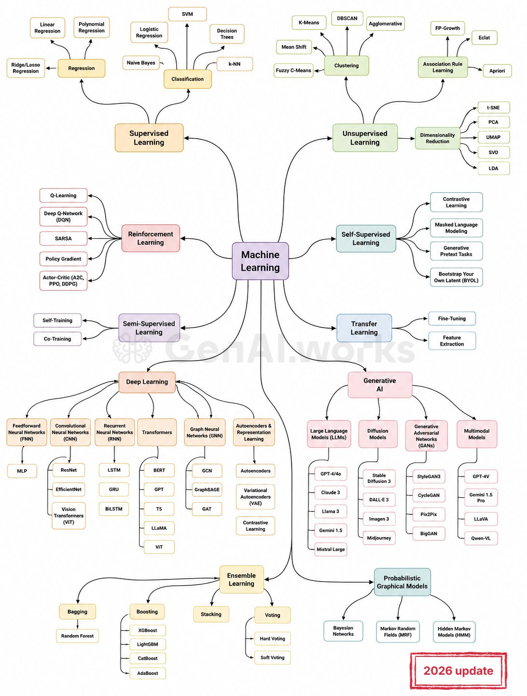

# 🧠 ML Models Interview Prep

[](https://python.org)
[](LICENSE)
[](https://jupyter.org)

A comprehensive, hands-on repository covering **68+ machine learning algorithms** — from linear regression to transformers, GANs, and reinforcement learning. Built for **interview preparation** with practice notebooks, verified solutions, and interview questions.



---

## 📋 Table of Contents

- [🧠 ML Models Interview Prep](#-ml-models-interview-prep)
  - [📋 Table of Contents](#-table-of-contents)
  - [🎯 Overview](#-overview)
  - [📁 Repository Structure](#-repository-structure)
  - [🚀 How to Use](#-how-to-use)
    - [For Self-Study](#for-self-study)
    - [For Interview Prep](#for-interview-prep)
  - [⚙️ Setup](#️-setup)
    - [Prerequisites](#prerequisites)
    - [Installation](#installation)
    - [Python Version](#python-version)
  - [🗺️ Phases \& Roadmap](#️-phases--roadmap)
  - [📓 Notebook Format](#-notebook-format)
  - [☁️ GPU \& Cloud Infrastructure](#️-gpu--cloud-infrastructure)
  - [🤝 Contributing](#-contributing)
  - [📄 License](#-license)

---

## 🎯 Overview

This repository is designed for ML practitioners preparing for **technical interviews**. Each algorithm includes:

- **Practice Notebook** — Theory intro + guided exercises with `# TODO` blocks
- **Solutions Notebook** — Complete, runnable reference implementations
- **Interview Questions** — Common questions with detailed answers
- **Synthetic Data** — Self-contained datasets, no external downloads needed

The curriculum covers **10 major ML categories**:

| # | Category | Algorithms |
|---|----------|-----------|
| 1 | Supervised Learning: Regression | Linear, Polynomial, Ridge/Lasso |
| 2 | Supervised Learning: Classification | Logistic, Naive Bayes, SVM, Decision Trees, k-NN |
| 3 | Unsupervised Learning | K-Means, DBSCAN, PCA, t-SNE, Apriori, +8 more |
| 4 | Ensemble Learning | Random Forest, XGBoost, LightGBM, CatBoost, +3 more |
| 5 | Deep Learning: Foundations | MLP, CNN, RNN, LSTM, GRU, Autoencoder |
| 6 | Deep Learning: Advanced | Transformers, BERT, GPT, GNNs, VAE, +5 more |
| 7 | Reinforcement Learning | Q-Learning, SARSA, DQN, Policy Gradient, Actor-Critic |
| 8 | Semi/Self-Supervised + Transfer | Self-Training, BYOL, Fine-Tuning, +5 more |
| 9 | Generative AI | LLMs, Diffusion, GANs, Multimodal |
| 10 | Probabilistic Graphical Models | Bayesian Networks, MRF, HMM |

---

## 📁 Repository Structure

```
ml-models-interview-prep/
├── 01-supervised-learning/
│   ├── regression/          # Linear, Polynomial, Ridge/Lasso
│   └── classification/     # Logistic, Naive Bayes, SVM, Decision Trees, k-NN
├── 02-unsupervised-learning/
│   ├── clustering/          # K-Means, Mean Shift, DBSCAN, ...
│   ├── dimensionality-reduction/  # PCA, t-SNE, UMAP, SVD, LDA
│   └── association-rule-learning/ # Apriori, Eclat, FP-Growth
├── 03-ensemble-learning/    # Random Forest, XGBoost, Stacking, Voting
├── 04-deep-learning/        # MLP, CNN, RNN, Transformers, GNNs, Autoencoders
├── 05-reinforcement-learning/
├── 06-semi-supervised-learning/
├── 07-self-supervised-learning/
├── 08-transfer-learning/
├── 09-generative-ai/        # LLMs, Diffusion, GANs, Multimodal
├── 10-probabilistic-graphical-models/
├── infrastructure/          # Terraform configs for GPU/cloud
└── assets/
```

Each algorithm folder contains:
```
<algorithm>/
├── <algorithm>_practice.ipynb     # Your workspace — fill in the TODOs
├── <algorithm>_solutions.ipynb    # Verified reference implementation
└── data/                          # Synthetic/sample datasets (if needed)
```

---

## 🚀 How to Use

### For Self-Study
1. **Start with Phase 1** — work through each algorithm sequentially
2. **Open the practice notebook** — read the theory, then implement the TODOs
3. **Run your code** — test against the embedded assertions
4. **Check the solutions** — compare your approach with the reference
5. **Review interview questions** — practice answering them aloud
6. **Move to the next algorithm** when comfortable

### For Interview Prep
- Focus on the **Interview Questions** section in each notebook
- Practice the **from-scratch implementations** — interviewers love these
- Understand the **math & intuition** — be ready to explain on a whiteboard
- Try the **Challenge** exercises — they simulate interview difficulty

---

## ⚙️ Setup

### Prerequisites
- Python 3.10+ (developed with 3.13.5)
- pip or conda

### Installation

```bash
# Clone the repository
git clone https://github.com/<your-username>/ml-models-interview-prep.git
cd ml-models-interview-prep

# Create virtual environment (recommended)
python3 -m venv .venv
source .venv/bin/activate  # macOS/Linux
# .venv\Scripts\activate   # Windows

# Install dependencies
pip install -r requirements.txt

# Launch Jupyter
jupyter lab
```

### Python Version
This repo is developed with Python 3.13.5. The minimum required version is specified in `requirements.txt` and can be easily updated.

---

## 🗺️ Phases & Roadmap

Progress is tracked in [PROGRESS.md](PROGRESS.md).

| Phase | Category | Status |
|-------|----------|--------|
| 1 | Regression + Repo Setup | ✅ Complete |
| 2 | Classification | ✅ Complete |
| 3 | Unsupervised Learning | ✅ Complete |
| 4 | Ensemble Learning | ✅ Complete |
| 5 | Deep Learning: Foundations | ✅ Complete |
| 6 | Deep Learning: Advanced | 🔲 Not Started |
| 7 | Reinforcement Learning | 🔲 Not Started |
| 8 | Semi/Self-Supervised + Transfer | 🔲 Not Started |
| 9 | Generative AI | 🔲 Not Started |
| 10 | Probabilistic Graphical Models | 🔲 Not Started |

---

## 📓 Notebook Format

Every notebook follows a consistent 7-section structure:

1. **🎯 Overview** — What, when, why, real-world applications
2. **📐 Math & Intuition** — Key formulas with intuitive explanations
3. **🔧 From Scratch** — NumPy/PyTorch implementation
4. **📦 Library Implementation** — scikit-learn / PyTorch usage
5. **🧪 Experiments** — Hyperparameters, edge cases, comparisons
6. **❓ Interview Questions** — 5-10 questions with answers
7. **🏆 Challenge** — A harder exercise to test mastery

---

## ☁️ GPU & Cloud Infrastructure

For deep learning phases (5-9), notebooks are designed to run on CPU with small synthetic datasets. For GPU-accelerated training:

- **Google Colab** — Free GPU access, upload notebooks directly
- **Terraform Configs** — `infrastructure/` contains IaC for:
  - GCP: GKE with GPU node pools
  - AWS: EKS with GPU instances
  - Quick launch & destroy to minimize cost

See [infrastructure/README.md](infrastructure/README.md) for details.

---

## 🤝 Contributing

Contributions are welcome! If you find errors, have better explanations, or want to add algorithms:

1. Fork the repository
2. Create a feature branch (`git checkout -b feature/improve-svm`)
3. Commit your changes (`git commit -m 'Improve SVM notebook'`)
4. Push to the branch (`git push origin feature/improve-svm`)
5. Open a Pull Request

---

## 📄 License

This project is licensed under the MIT License — see [LICENSE](LICENSE) for details.

---

**Happy Learning! 🎓**

*Built with curiosity, presence, and connection — the values behind everything I create.*
